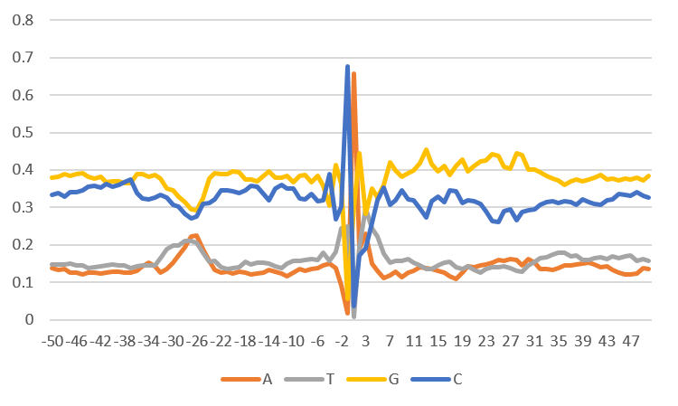

##############################
*Base Distribution*
##############################
The ``base_distribution`` tool computes the average base composition at each position of the given region.

.. note::

    This tool requires `bedtools <https://github.com/arq5x/bedtools2>`_ to be installed.
    This tool requires hg38.fa to be downloaded to ~/GC_bioinfo/src/static. This can be done by running the commands
    at the bottom of this page.

===============================
Usage
===============================
**Usage**:
::

  python3 base_distribution.py <Regions Filename>

===========================    =========================================================================================================================================================
Option                         Description
===========================    =========================================================================================================================================================
**Regions Filename**           Bed formatted file containing all the regions you want to average the sequences.

===========================    =========================================================================================================================================================

==========================================================================
Behavior
==========================================================================
``base_distribution`` will report the position relative to the middle of the region and the percent occupancy of each base.

For example:

.. code-block:: bash

  $ head promoters.bed
  chr22   50530842        50531042        TYMP    -9.065193631    -
  chr6    117907163       117907363       SLC35F1 -9.065193631    +
  chr13   20160975        20161175        GJA3    -7.733930386    -
  chr19   8832234 8832434 MBD3L1  -7.661525679    +
  chr8    98294094        98294294        NIPAL2  -7.647940659    -
  chr9    97501536        97501736        TMOD1   -7.602930939    +
  chr10   45374090        45374290        ALOX5   -7.446900692    +
  chr3    150703791       150703991       ERICH6  -7.428657658    -
  chr11   827195  827395  CRACR2B -7.368074425    +
  chr1    180229938       180230138       LHX4    -7.356983285    +

  $ python3 base_distribution.py promoter.bed
  $ head -n 1 promoter-base_distribution_plot.tsv # Print out the headers
  Position        A       T       G       C
  $ head -n 151 promoter-base_distribution_plot.tsv | tail -n 100 # Print out the middle 100 bp
  -50.0   0.1387323943661972      0.14859154929577464     0.3789612676056338      0.33371478873239435
  -49.0   0.13265845070422536     0.14621478873239438     0.3824823943661972      0.33855633802816903
  -48.0   0.13441901408450704     0.14744718309859156     0.38882042253521126     0.32931338028169016
  -47.0   0.1255281690140845      0.1487676056338028      0.3852112676056338      0.34049295774647886
  -46.0   0.12570422535211268     0.1459507042253521      0.38794014084507045     0.34040492957746477
  -45.0   0.12068661971830986     0.1442781690140845      0.39066901408450705     0.3443661971830986
  -44.0   0.126056338028169       0.13723591549295774     0.3818661971830986      0.35484154929577466
  -43.0   0.12544014084507044     0.14005281690140844     0.3778169014084507      0.35669014084507045
  -42.0   0.12411971830985916     0.1419894366197183      0.3806338028169014      0.3532570422535211
  -41.0   0.12544014084507044     0.14419014084507042     0.36698943661971833     0.36338028169014086
  -40.0   0.12746478873239436     0.14700704225352113     0.3701584507042254      0.35536971830985914
  -39.0   0.12772887323943663     0.14410211267605633     0.36875 0.35941901408450705
  -38.0   0.1250880281690141      0.14410211267605633     0.3642605633802817      0.3665492957746479
  -37.0   0.1255281690140845      0.13670774647887324     0.3643485915492958      0.37341549295774645
  -36.0   0.13036971830985916     0.14375 0.3886443661971831      0.3372359154929577
  -35.0   0.1419894366197183      0.14454225352112676     0.38943661971830984     0.3240316901408451
  -34.0   0.15316901408450703     0.14515845070422534     0.3808098591549296      0.320862676056338
  -33.0   0.1420774647887324      0.1442781690140845      0.386443661971831       0.32720070422535213
  -32.0   0.12588028169014084     0.1641725352112676      0.3762323943661972      0.33371478873239435
  -31.0   0.13565140845070423     0.1875880281690141      0.3514964788732394      0.32526408450704225
  -30.0   0.1511443661971831      0.19797535211267606     0.34507042253521125     0.3058098591549296
  -29.0   0.17235915492957746     0.19718309859154928     0.3294014084507042      0.301056338028169
  -28.0   0.1926056338028169      0.2097711267605634      0.31408450704225355     0.2835387323943662
  -27.0   0.22297535211267605     0.21100352112676057     0.2955985915492958      0.2704225352112676
  -26.0   0.22526408450704224     0.20651408450704226     0.2915492957746479      0.2766725352112676
  -25.0   0.18899647887323945     0.17922535211267607     0.3233274647887324      0.3084507042253521
  -24.0   0.15607394366197183     0.15536971830985916     0.37649647887323945     0.31205985915492956
  -23.0   0.1323943661971831      0.15607394366197183     0.39049295774647885     0.3210387323943662
  -22.0   0.12640845070422535     0.1392605633802817      0.38882042253521126     0.3455105633802817
  -21.0   0.12852112676056338     0.136443661971831       0.38873239436619716     0.34630281690140846
  -20.0   0.12306338028169014     0.13714788732394367     0.396919014084507       0.34286971830985913
  -19.0   0.12904929577464788     0.1409330985915493      0.3927816901408451      0.3372359154929577
  -18.0   0.12658450704225352     0.15369718309859154     0.375   0.3447183098591549
  -17.0   0.12033450704225353     0.14788732394366197     0.37341549295774645     0.35836267605633804
  -16.0   0.12438380281690141     0.15255281690140846     0.36875 0.3543133802816901
  -15.0   0.12684859154929579     0.15299295774647886     0.385387323943662       0.33477112676056336
  -14.0   0.13230633802816902     0.15026408450704226     0.39735915492957746     0.3200704225352113
  -13.0   0.1283450704225352      0.14295774647887324     0.3786091549295775      0.3500880281690141
  -12.0   0.12350352112676057     0.13732394366197184     0.3786091549295775      0.36056338028169016
  -11.0   0.11505281690140845     0.15017605633802816     0.3836267605633803      0.3511443661971831
  -10.0   0.12623239436619718     0.15704225352112677     0.36698943661971833     0.34973591549295774
  -9.0    0.13485915492957745     0.15818661971830986     0.38301056338028167     0.323943661971831
  -8.0    0.13160211267605634     0.15994718309859154     0.38617957746478876     0.32227112676056335
  -7.0    0.13538732394366196     0.16311619718309858     0.3664612676056338      0.33503521126760566
  -6.0    0.13846830985915493     0.1601232394366197      0.385387323943662       0.3160211267605634
  -5.0    0.1448943661971831      0.17887323943661973     0.35651408450704225     0.31971830985915495
  -4.0    0.1506161971830986      0.15607394366197183     0.30378521126760566     0.38952464788732394
  -3.0    0.13723591549295774     0.1823943661971831      0.4128521126760563      0.26751760563380284
  -2.0    0.0926056338028169      0.24313380281690142     0.3613556338028169      0.3029049295774648
  -1.0    0.017077464788732396    0.2500880281690141      0.055105633802816904    0.6777288732394366
  1.0     0.65625 0.006602112676056338    0.3011443661971831      0.036003521126760564
  2.0     0.18882042253521128     0.19568661971830986     0.44348591549295774     0.17200704225352112
  3.0     0.22852112676056338     0.2971830985915493      0.28265845070422535     0.19163732394366198
  4.0     0.14867957746478874     0.2432218309859155      0.3506161971830986      0.2574823943661972
  5.0     0.13028169014084506     0.22350352112676056     0.3261443661971831      0.3200704225352113
  6.0     0.11100352112676057     0.1772007042253521      0.3589788732394366      0.3528169014084507
  7.0     0.11901408450704225     0.15220070422535212     0.42068661971830984     0.30809859154929575
  8.0     0.12764084507042253     0.15669014084507044     0.3977112676056338      0.31795774647887326
  9.0     0.11461267605633803     0.157306338028169       0.3818661971830986      0.34621478873239436
  10.0    0.12464788732394366     0.1618838028169014      0.3909330985915493      0.32253521126760565
  11.0    0.1307218309859155      0.15149647887323944     0.3998239436619718      0.31795774647887326
  12.0    0.13987676056338028     0.14559859154929577     0.4176056338028169      0.29691901408450705
  13.0    0.1375  0.13468309859154928     0.45404929577464787     0.2737676056338028
  14.0    0.13441901408450704     0.13468309859154928     0.41522887323943664     0.31566901408450704
  15.0    0.1295774647887324      0.14577464788732394     0.3957746478873239      0.3288732394366197
  16.0    0.12455985915492958     0.151056338028169       0.40994718309859157     0.3144366197183099
  17.0    0.11522887323943662     0.15440140845070421     0.3854753521126761      0.3448943661971831
  18.0    0.10774647887323943     0.1391725352112676      0.4108274647887324      0.34225352112676055
  19.0    0.12517605633802817     0.1358274647887324      0.4269366197183099      0.31205985915492956
  20.0    0.1426056338028169      0.14216549295774647     0.3956866197183099      0.31954225352112675
  21.0    0.13952464788732394     0.13230633802816902     0.4113556338028169      0.31681338028169015
  22.0    0.14401408450704226     0.12526408450704227     0.42200704225352115     0.3087147887323944
  23.0    0.14762323943661973     0.13653169014084507     0.4261443661971831      0.2897007042253521
  24.0    0.15308098591549296     0.14075704225352112     0.4430457746478873      0.2631161971830986
  25.0    0.16003521126760564     0.14075704225352112     0.4382922535211268      0.26091549295774646
  26.0    0.15721830985915494     0.1425176056338028      0.40941901408450704     0.2908450704225352
  27.0    0.16311619718309858     0.13855633802816902     0.40466549295774645     0.2936619718309859
  28.0    0.15845070422535212     0.13054577464788733     0.4452464788732394      0.26575704225352115
  29.0    0.14419014084507042     0.1278169014084507      0.4397887323943662      0.28820422535211265
  30.0    0.16267605633802817     0.1454225352112676      0.4004401408450704      0.2914612676056338
  31.0    0.15149647887323944     0.15422535211267605     0.4005281690140845      0.29375
  32.0    0.13538732394366196     0.16399647887323943     0.3929577464788732      0.3076584507042254
  33.0    0.13547535211267606     0.16619718309859155     0.3840669014084507      0.3142605633802817
  34.0    0.13318661971830986     0.17403169014084507     0.3762323943661972      0.3165492957746479
  35.0    0.1369718309859155      0.17940140845070424     0.372887323943662       0.3107394366197183
  36.0    0.14392605633802816     0.17869718309859156     0.3596830985915493      0.31769366197183097
  37.0    0.1460387323943662      0.16963028169014085     0.3691901408450704      0.31514084507042256
  38.0    0.1482394366197183      0.17165492957746478     0.37367957746478875     0.30642605633802816
  39.0    0.14911971830985915     0.1585387323943662      0.3704225352112676      0.321919014084507
  40.0    0.1515845070422535      0.15985915492957747     0.3742957746478873      0.3142605633802817
  41.0    0.14762323943661973     0.16461267605633803     0.37869718309859157     0.3090669014084507
  42.0    0.13908450704225353     0.1670774647887324      0.38723591549295777     0.30660211267605636
  43.0    0.1431338028169014      0.1630281690140845      0.373943661971831       0.3198943661971831
  44.0    0.1323943661971831      0.1694542253521127      0.37755281690140846     0.32059859154929576
  45.0    0.12596830985915494     0.1641725352112676      0.3731514084507042      0.33670774647887325
  46.0    0.12015845070422536     0.1693661971830986      0.3772887323943662      0.3331866197183099
  47.0    0.1216549295774648      0.17174295774647888     0.3743838028169014      0.3322183098591549
  48.0    0.12341549295774648     0.15774647887323945     0.3789612676056338      0.3398767605633803
  49.0    0.1369718309859155      0.1609154929577465      0.3720070422535211      0.3301056338028169
  50.0    0.13477112676056338     0.15598591549295773     0.38301056338028167     0.32623239436619716

===============================
Download hg38.fa
===============================
**Download hg38.fa**:
To download the hg38.fa (fasta file for the whole genome), run the following commands in the static directory:

.. code-block:: bash

  wget http://hgdownload.soe.ucsc.edu/goldenPath/hg38/bigZips/hg38.fa.gz
  gunzip hg38.fa.gz

