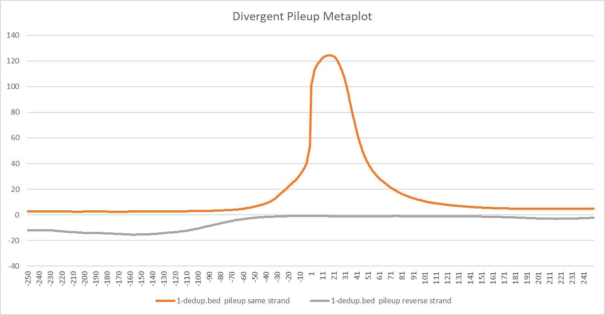

##############################
*Divergent Pileup Metaplot*
##############################
The ``divergent_pileup_metaplot`` tool computes the coverage of reads data around the center of features provided.

===============================
Usage and option summary
===============================
**Usage**:
::

  python3 divergent_pileup_metaplot.py <Regions Filename> <Sequencing Files>

===========================    =========================================================================================================================================================
Option                         Description
===========================    =========================================================================================================================================================
**Regions Filename**           Bed formatted file containing all the genes to quantify (+1 nucleotide centered)
**Sequencing Files**           Sequencing files to quantify separated by spaces.
===========================    =========================================================================================================================================================

==========================================================================
Behavior
==========================================================================
``divergent_pileup_metaplot`` will report the position relative to the center of the regions provided and the average
of the reads at that position.

For example:

\

.. code-block:: bash

  $ cat CCNT1_inr.bed
  chr12   48716697        48716717        CCNT1   0       -

  $ head -n 5 control.bed
  chr1    10080   10380   K00294:149:H35VNBBXY:6:2108:3742:16524  255     -
  chr1    10563   10611   K00294:149:H35VNBBXY:6:1126:31730:23241 255     -
  chr1    10563   10600   K00294:149:H35VNBBXY:6:2206:29630:38627 255     -
  chr1    10564   10620   K00294:149:H35VNBBXY:6:1212:19441:27971 255     -
  chr1    10564   10611   K00294:149:H35VNBBXY:6:1211:31121:35022 255     -

  $ python3 divergent_pileup_metaplot.py CCNT1_inr.bed control.bed
  Position        control.bed pileup same strand      control.bed pileup reverse strand
  -10.0   66      0
  -9.0    74      0
  -8.0    74      0
  -7.0    75      0
  -6.0    81      0
  -5.0    81      0
  -4.0    78      0
  -3.0    78      0
  -2.0    79      0
  -1.0    76      0
  1.0     103     0
  2.0     107     0
  3.0     108     0
  4.0     111     0
  5.0     111     0
  6.0     111     0
  7.0     111     0
  8.0     112     0
  9.0     110     0
  10.0    104     0
