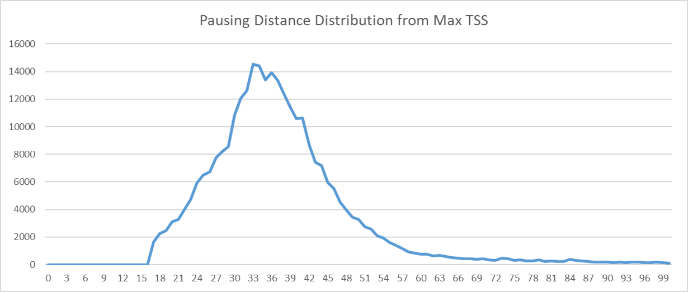

#############################################
*Pausing Distance Distribution from Max TSS*
#############################################
The ``pausing_distance_distribution_from_maxTSS`` tool computes the number of transcripts with certain lengths containing a 5' end at the maxTSS.

===============================
Usage
===============================
**Usage**:
::

  GC_bioinfo pausing_distance_distribution_from_maxTSS.py <regions file> <sequencing files>

===========================    =========================================================================================================================================================
Option                         Description
===========================    =========================================================================================================================================================
**Regions Filename**           Bed formatted file containing all the regions you want to quantify (must be centered on +1 nt)
**Sequencing Files**           Sequencing files to quantify separated by spaces.
===========================    =========================================================================================================================================================

==========================================================================
Behavior
==========================================================================
``pausing_distance_distribution_from_maxTSS`` will report the transcript length and the number of transcripts that length that begin at the +1 nt

For example:

\

.. code-block:: bash

  $ head promoters.bed
  chr4    498989  499489  PIGG    38      +
  chr4    674291  674791  MYL5    17      +
  chr4    705581  706081  PCGF3   41      +
  chr4    932209  932709  TMEM175 33      +
  chr4    1011383 1011883 FGFRL1  29      +
  chr4    1289643 1290143 MAEA    83      +
  chr4    1346997 1347497 UVSSA   47      +
  chr4    1721268 1721768 TACC3   56      +
  chr4    1793042 1793542 FGFR3   216     +
  chr4    1871130 1871630 NSD2    11      +

  $ head control.bed
  chr1    11242   11265   A00876:65:HLHG7DRXX:2:2274:6922:19867   255     -
  chr1    11295   11325   A00876:65:HLHG7DRXX:1:2165:16432:10473  255     -
  chr1    11691   11829   A00876:65:HLHG7DRXX:1:2203:10059:23171  255     +
  chr1    11760   11914   A00876:65:HLHG7DRXX:1:2269:19560:5181   255     -
  chr1    12019   12114   A00876:65:HLHG7DRXX:2:2276:27208:3928   255     -
  chr1    12285   12312   A00876:65:HLHG7DRXX:2:2220:16767:29778  255     -
  chr1    12291   12376   A00876:65:HLHG7DRXX:1:2112:17400:17096  255     -
  chr1    12302   12342   A00876:65:HLHG7DRXX:2:2145:2483:31219   255     -
  chr1    12310   12348   A00876:65:HLHG7DRXX:1:2273:11478:4492   255     -
  chr1    12381   12401   A00876:65:HLHG7DRXX:1:2219:8829:14434   255     +

  $ GC_bioinfo pausing_distance_distribution_from_maxTSS.py regions.bed control.bed > output.tmp
  $ head -n 30 output.tmp
  1-dedup.bed     2-dedup.bed
  0       0
  1       0
  2       0
  3       0
  4       0
  5       0
  6       0
  7       0
  8       0
  9       0
  10      0
  11      0
  12      0
  13      0
  14      0
  15      0
  16      0
  17      1652
  18      2257
  19      2474
  20      3094
  21      3272
  22      3994
  23      4733
  24      5932
  25      6481
  26      6722
  27      7733
  28      8197
