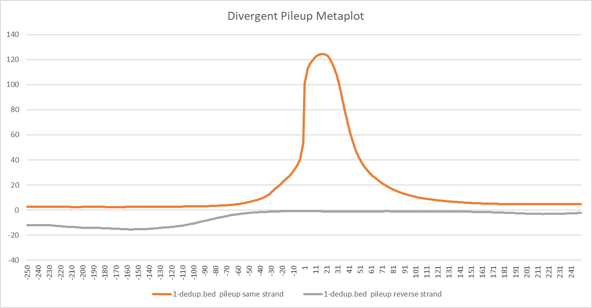

##############################
*Metaplot*
##############################
The ``metaplot`` tool computes the average coverage of [5'/3'/pileup] reads of sequencing data around the center of features provided.

.. note::

    This tool requires `bedtools <https://github.com/arq5x/bedtools2>`_ to be installed.

===============================
Usage and option summary
===============================
**Usage**:
::

  PolTools metaplot [-h] [-t [threads]]
                           read type regions_file sequencing_files
                           [sequencing_files ...]

===========================    =========================================================================================================================================================
Required Arguments                         Description
===========================    =========================================================================================================================================================
**Read type**                  Either five, three or whole corresponding to 5' ends, 3' ends, or pileup reads.
**Regions File**               Bed formatted file containing all the regions to quantify (+1 nucleotide centered). These regions can be made from the `make_regions_file_centered_on_max_tss program <https://geoffscollins.github.io/PolTools/make_regions_file_centered_on_max_tss.html>`_
**Sequencing Files**           Bed formatted file from a sequencing experiment.
===========================    =========================================================================================================================================================

===========================    =========================================================================================================================================================
Optional Arguments                         Description
===========================    =========================================================================================================================================================
**-t, --threads**              Maximum number of threads. Default is the number of threads on the system. This program will not use more threads than the number of sequencing files provided
**Sequencing Files**           Additional sequencing files can be provided.
===========================    =========================================================================================================================================================

==========================================================================
Behavior
==========================================================================
``metaplot`` will report the position relative to the center of the regions provided and the average
of the [5', 3', or pileup] reads at that position.

For example:

\

.. code-block:: bash

  $ head regions_centered_on_max_tss.bed
  chr1    959251  959261  NOC2L   46      -
  chr1    960627  960637  KLHL17  27      +
  chr1    966516  966526  PLEKHN1 8       +
  chr1    1000092 1000102 HES4    87      -
  chr1    1000290 1000300 ISG15   12      +
  chr1    1020114 1020124 AGRN    35      +
  chr1    1074302 1074312 RNF223  10      -
  chr1    1116102 1116112 C1orf159        9       -
  chr1    1231967 1231977 SDF4    321     -
  chr1    1232237 1232247 B3GALT6 174     +

  $ head seq_file.bed
  chr1    11981   12023   A00876:119:HW5F5DRXX:1:2168:2248:1407   255     -
  chr1    13099   13117   A00876:119:HW5F5DRXX:1:2203:31403:26757 255     -
  chr1    13356   13423   A00876:119:HW5F5DRXX:1:2151:15808:7827  255     -
  chr1    13435   13477   A00876:119:HW5F5DRXX:1:2273:15781:19241 255     -
  chr1    13739   13772   A00876:119:HW5F5DRXX:1:2256:29966:10520 255     -
  chr1    13741   13773   A00876:119:HW5F5DRXX:1:2235:4101:11882  255     -
  chr1    14178   14203   A00876:119:HW5F5DRXX:1:2115:8241:31422  255     -
  chr1    14734   14768   A00876:119:HW5F5DRXX:1:2165:23764:2440  255     -
  chr1    14988   15012   A00876:119:HW5F5DRXX:1:2219:16134:32784 255     -
  chr1    18337   18362   A00876:119:HW5F5DRXX:1:2149:32054:31328 255     -

  $ PolTools three CCNT1_inr.bed control.bed
  Position       seq_file.bed 3' sense strand    seq_file.bed 3' divergent strand
  -5.0    0.8859940872135994      -0.01579822616407982
  -4.0    0.6057834441980784      -0.013673318551367332
  -3.0    0.7096267553584626      -0.008961566888396156
  -2.0    1.2311529933481153      -0.013673318551367332
  -1.0    0.5052660753880266      -0.02836289726533629
  1.0     1.432280118255728       -0.00655949741315595
  2.0     0.7416851441241685      -0.01607538802660754
  3.0     0.7222838137472284      -0.012564671101256468
  4.0     1.445861049519586       -0.010809312638580931
  5.0     1.1093865484109386      -0.014689578713968959
