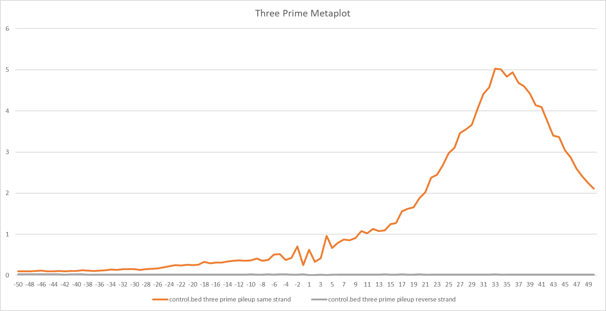

##############################
*Three Prime Metaplot*
##############################
The ``three_prime_metaplot`` tool computes the average coverage of 3' ends of sequencing data around the center of features provided.

===============================
Usage and option summary
===============================
**Usage**:
::

  GC_bioinfo three_prime_metaplot.py <Regions Filename> <Sequencing Files>

===========================    =========================================================================================================================================================
Option                         Description
===========================    =========================================================================================================================================================
**Regions Filename**           Bed formatted file containing all the genes to quantify (+1 nucleotide centered)
**Sequencing Files**           Sequencing files to quantify separated by spaces.
===========================    =========================================================================================================================================================

==========================================================================
Behavior
==========================================================================
``three_prime_metaplot`` will report the position relative to the center of the regions provided and the average
of the 3' reads at that position.

For example:

\

.. code-block:: bash

  $ cat CCNT1_inr.bed
  chr12   48716697        48716717        CCNT1   0       -

  $ head -n 5 control.bed
  chr1    10080   10380   K00294:149:H35VNBBXY:6:2108:3742:16524  255     -
  chr1    10563   10611   K00294:149:H35VNBBXY:6:1126:31730:23241 255     -
  chr1    10563   10600   K00294:149:H35VNBBXY:6:2206:29630:38627 255     -
  chr1    10564   10620   K00294:149:H35VNBBXY:6:1212:19441:27971 255     -
  chr1    10564   10611   K00294:149:H35VNBBXY:6:1211:31121:35022 255     -

  $ GC_bioinfo three_prime_metaplot.py CCNT1_inr.bed control.bed
  Position        control.bed 5' same strand  control.bed 5' reverse strand
  -10.0   0.0     0.0
  -9.0    3.0     0.0
  -8.0    0.0     0.0
  -7.0    0.0     0.0
  -6.0    0.0     0.0
  -5.0    5.0     0.0
  -4.0    0.0     0.0
  -3.0    0.0     0.0
  -2.0    3.0     0.0
  -1.0    1.0     0.0
  1.0     2.0     0.0
  2.0     0.0     0.0
  3.0     0.0     0.0
  4.0     0.0     0.0
  5.0     0.0     0.0
  6.0     0.0     0.0
  7.0     0.0     0.0
  8.0     2.0     0.0
  9.0     6.0     0.0
  10.0    1.0     0.0
